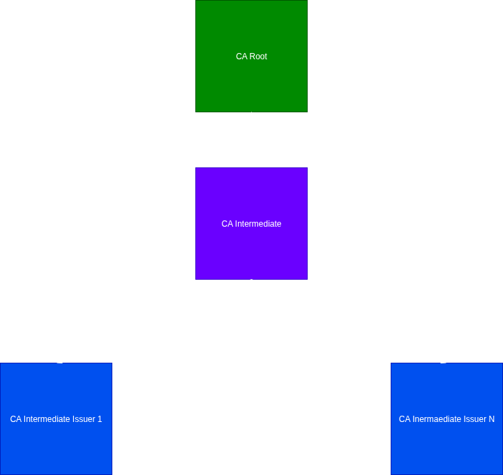

# caedgex

Scripts to create and manage CA (Certificate Authority) and configurations files.
(Scripts submitted to SAST tools)

# Introduction

To manage and create certificates for development and testing servers, services and containers, it was necessary to have a CA to issue certificates with different purposes. Due to security reasons and managment issues, it was decided to create a local CA dedicated to the projects.

As a first approach, a standalone CA was created, but for additional security and management measures, as testing and development systems for various platforms evolved and expanded, the change was made to a CA hierarchy.  Additionally, it was necessary, in addition to server certificates, to create certificates for other purposes such as users and test emails. Therefore, it was necessary to:

- Isolate the root CA. After the intermediate CA is created, root CA should be put offline or hidden.
- Create an intermediate CA to manage the CAs (intermediate issuer CA) responsible for issuing certificates.
- Create a CA with policies and rules tailored to its purpose to create different types of certificates, which are managed by different team members.

Along the way, this project became a source of knowledge, teaching and testing, observing a lack of articles to build a "all-in-one" CA structure using several configurations for certificates issueing.
Setting up a CA is a great learning experience.
There are _open-source_ systems to implement PKI with automatic certificates renewal like Keyfactor / EJBCA, Dogtag, OpenXPKI or utilities like Easy-RSA for managing X.509 PKI.
This can also suitable for small set of services / servers / containers / users, but extending the ecosystem, it is more advisable to adopt other PKI solutions, like the ones referred above.

# Information and Knowledge

There are a lot of information "out there" and sometimes can be overwhelming. So, to get knowledge about, I suggest the reading of following pages:

- "https://docs.openssl.org/3.2/man7/ossl-guide-introduction/"
- "https://arminreiter.com/2022/01/create-your-own-certificate-authority-ca-using-openssl/"
- "https://openssl-ca.readthedocs.io/en/latest/introduction.html"

It is not pretended here to give the information and knowledge in detail, but put hands-on and test using the information that can be read in the internet, and so read the articles / pages above.

# Notes

The key size is defined as 4096 bytes. I do not use 2048 anymore.

# Extensions

Several extensions are defined in the CA configuration files ("ca.conf"), with different definitions whether to use for request or certificate creation, and for different key or certificate usages.

- req_ca_ext
    - Extension to use to create request for a CA certificate.
- req_ca_issuer_ext
    - Extension request for CA issuer (issue not CA certificates).
- req_client_ext
    - Use this extension when creating a client certificate. It is intencionaly empty.
- root_ca_ext
    - Extension to use when root CA certificate should be submitted and created.
- ca_ext
    - General extension to use for CA certificate creation. This do not define subject alternative names.
- int_ca_ext
    - When creating a intermediate CA certificate, use this extension.
- int_ca_issuer_ext
    - Extension for intermediate CA issuer.
- identity_cert_ext
    - User certificate extension.
- codesign_cert_ext
    - Codesign certificate.
- vpn_client_cert_ext
    - VPN certificate.
- server_client_cert_ext
    - Server and Client Authentication certificate.
- server_cert_ext
    - Server certificate.
- timestamp_cert_ext
    - Timestamp certificate
- ocsp_ext
    - If OCSP protocol is used to check the certificate validity.

# CA hierarchy

- CA Root
- CA Intermediate
- CA Intermediate Issuer 1 … N

# Files

## Structure

- any-ca-dir-structure.tar.gz
    - Base Directory structure and files for each CA.

## Templates and Configuration Files

- ca-root-template
    - Directory structure and configuration file to manage a root CA.
- ca-intca-template
    - Directory structure and configuration file to manage a intermediate CA. The purpose is to use only to issue certificates for child CA to issue certificates for services. This would be the parent for child CA's each one with different purposes and configurations, for instance, a CA to issue user certificates, another CA to issue servers certificates, and so on.
- ca-intca-issuer-template
    - Directory structure and configuration file to manage a intermediate CA to issue certificates for user, client, servers, and so on. The CA configuration for this, include an option "pathlen=0" that won't permit to issue certificates for new CA's.

## Scripts

### Root CA

- cert-create-rootca-cert.sh
    - Create a self-signed ceritficate for the root CA.
- cert-create-rootca-key-ec.sh
    - Create a key to issue a certificate, using rsa encryption.
- cert-create-rootca-key-rsa.sh
    - Create a key but using EC encryption.

### Intermediate CA

- cert-create-intca-cert-chain.sh
    - Create a file with certificates chain in PEM format.
- cert-create-intca-key-ec.sh
    - Create a key for intermediate CA using EC encryption.
- cert-create-intca-key-rsa.sh
    - Create a key but using rsa encryption.
- cert-create-intca-request.sh
    - Create a request to issue certificate for this intermediate CA. This request should then submitted to parent CA.
- cert-submit-intca-cert-request.sh
    - Submit the above request. Issue certificate for this intermediate CA, submitting the request to parent CA.

### Key and Request Creation

- cert-create-key-ec.sh
    - Create a key. Key to begin a process to issue a certificate. Use EC encryption.
- cert-create-key-rsa.sh
    - Create a key. Key to begin a process to issue a certificate. Use rsa encryption.
- cert-create-request.sh
    - Create a request supplying a key. (Above).
- cert-create-key-request-ec.sh
    - Create a key and request at once using EC encryption. After this, submit the request to CA issuer.
- cert-create-key-request-rsa.sh
    - Create a key and request at once using rsa encryption. After this, submit the request to CA issuer.
- cert-create-key-request-s-ec.sh
    - Create a key and request at once using EC encryption. After this, submit the request to CA issuer. Alternative names are supplied as arguments, but subject is asked during the execution of the command.
- cert-create-key-request-s-rsa.sh
    - Create a key and request at once using rsa encryption. After this, submit the request to CA issuer. Alternative names are supplied as arguments, but subject is asked during the execution of the command.
- cert-create-key-request-sns-ec.sh
    - Create a key and request at once using EC encryption. After this, submit the request to CA issuer. Alternative names are supplied as arguments and use the subject defined in the extension in the CA configuration file. Command execution without asking values. Maybe useful for batch or bulk execution mode.
- cert-create-key-request-sns-rsa.sh
    - Create a key and request at once using rsa encryption.  After this, submit the request to CA issuer. Alternative names are supplied as arguments and use the subject defined in the extension in the CA configuration file. Command execution without asking values. Maybe useful for batch or bulk execution mode.

### Submit for Certificate

- cert-submit-cert-request-ext.sh
    - Submit the request (see Key and Request Creation) supplying the X509 extension defintion to use. The extension are defined in the CA configuration file. The extensions can be prepared and defined in the CA configuration file itself, or can be supplied as a standalone file. This script use X509 extensiondefinition.
- cert-submit-cert-request.sh
    - Submit the request (see Key and Request Creation) supplying the X509 extension defintion to use. The extension are defined in the CA configuration file. The extensions can be prepared and defined in the CA configuration file itself, or can be supplied as a standalone file. This script can use a external file for extension definition.

### Verify Certificate

- cert-verify-rootca-cert.sh
    - Verify the root CA certificate.
- cert-verify-intca-cert.sh
    - Verify the intermediate CA certificate. Indicate whether or not the CA parent certificate chain should be used.
- cert-verify.sh
    - Verify certificate. Indicate whether or not the CA certificate chain should be used.

### Revoke List

- cert-create-ca-revoke-list.sh
    - Create a revoke certificate list from CA.

### Revoke Certificate

- cert-revoke-cert.sh
    - Revoke certificate.

# Installation

All the files, exception the certificates, do not have any _other_ permissions. Security! Only owner user and owner group have permissions.

- Define and create a base path to store files for CA's and other stuff you may need to manage the CA such as scripts. In this project the base path is "/usr/local/etc/pki/ca".
- Set enviroment variable, "PKICA_CA_HOME_BASE", with the path defined above.
- I created additional directory level in order to have a copy of CA's for testing purposes. So CA's structures are stored in "/usr/local/etc/pki/ca/ca" for production, and "/usr/local/etc/pki/ca/ca-test" for testing.
- Define and create a base path to store files for CA's themselves. In this project the base path is "/usr/local/etc/pki/ca/ca".
- Set enviroment variable, "PKICA_CA_HOME", with the path defined above.
- Untar "any-ca-dir-structure.tar.gz" file in "PKICA_CA_HOME" and give a name to CA. Folder name should be the CA name.
- Copy the files from CA template that is pretended to use to the same folder with the same name in the CA structure.
- Edit "ca.conf" file (CA configuration file) and update with the CA name. Changes the lines:
    - Update "caname" (THE_CA_NAME).
    - Change "dnsdomain".
    - If is needed to define hostname for the CA, change "basehostname".
    - Update "ca_THE_CA_NAME" section name.
- Create a dedicated user and group for owner user and owner group, and apply to directories and files on "PKICA_CA_HOME_BASE" path.

# TODO

- Improve certificate extensions.
- Database for keys and certificates store.
- SCEP Server Integration. ACME protocol is more secure and robust, but it carries more challenges.
- Integrate cert-monger.
